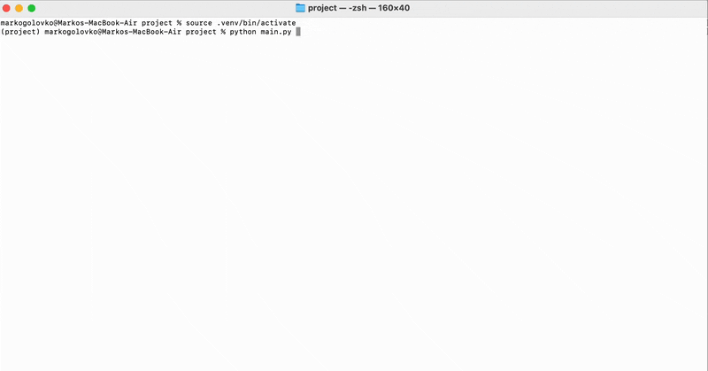
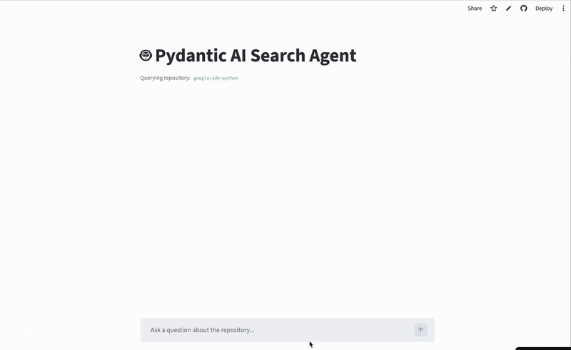

# Deep Wiki Agent

An AI-powered assistant that helps quickly find answers to Google ADK from its repository.
 
***

## Overview

Deep Wiki Agent is designed to let developers quickly retrieve accurate information from the Google ADK Python repository using AI agents.

Key capabilities:
- Uses AI agents to answer user questions based on repository content
- Supports automated evaluation of AI responses
- CLI and web-based interaction (Streamlit UI)

This project includes:
- Search Agent: Retrieves relevant code/documentation snippets
- Evaluation Agent: Automatically assesses agent responses against a checklist
- Question Generator Agent: Generates realistic questions for evaluation

***

## Installation

### Clone the repository

```
git clone https://github.com/GameRuiner/aiAgents.git
```

### Install dependencies

```
pip install uv
```

### Setup environment

```
uv sync
# Add your OpenAI API key to the .env file
```
***

## Usage

### CLI Mode

```
uv run main.py
```


### Web UI Mode (Streamlit)

```
uv run streamlit run app.py
```

***

## Features
- Intelligent Search: Retrieve precise answers from Google ADK Python repo
- Evaluation Pipeline: Assess AI agent responses automatically using a checklist
- Question Generation: Produce realistic developer questions for testing
- Logging: Records each interaction for analysis
- Multiple Interaction Modes: CLI and web interface

***

### Evaluations

The evaluation pipeline works as follows:
	1.	Generate questions – The question generation agent creates diverse and challenging questions from repository content.
	2.	Run agent – The main search agent answers each question.
	3.	Log interactions – Each interaction is logged to JSON files with metadata.
	4.	Evaluate responses – The evaluation agent scores each response against a checklist, assessing relevance, clarity, completeness, instructions adherence, and tool usage.
	5.	Aggregate results – Evaluation results are stored in a DataFrame to compute summary metrics for all interactions.


## Deployment

The app is deployed on Streamlit Community Cloud:
- Code is connected to the GitHub repository
- Streamlit automatically updates whenever the main branch is refreshed
- Both CLI and Web UI are supported

***

## FAQ / Troubleshooting
- API Key not set: Ensure OPENAI_API_KEY is added to your .env
- Missing dependencies: Run pip install uv and uv sync

***

## Credits / Acknowledgments
-	DataTalksClub – Open-source course materials
-	Alexey Grigorev – AI Agents Crash Course
-	Main libraries:
-	pydantic-ai for AI agent handling
-	minsearch for search functionality
